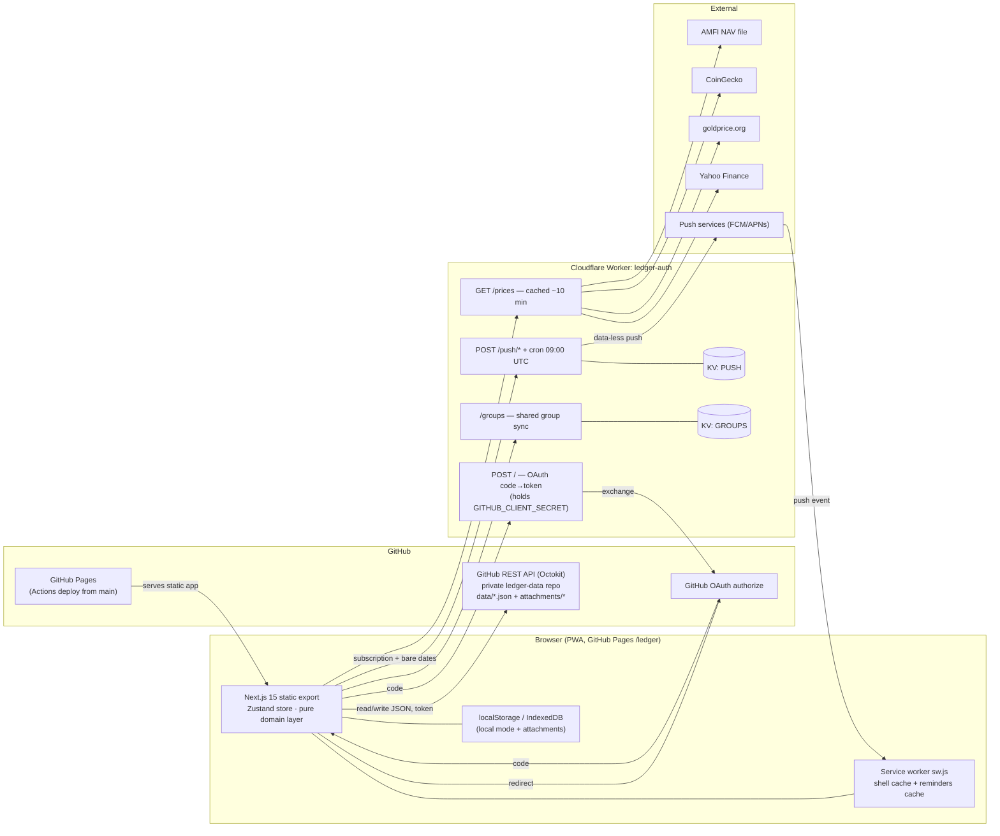

# 02 — Architecture

## Tech stack

| Layer | Choice | Notes |
| --- | --- | --- |
| Framework | Next.js 15.5.19, App Router, `output: "export"` | Fully static; `trailingSlash: true`; `images.unoptimized`; optional `basePath` from `NEXT_PUBLIC_BASE_PATH` (`next.config.ts`) |
| Language | TypeScript 5.x, strict | Worker has its own tsconfig (ES2022) |
| UI | React 19.2.4 (exact-pinned), Tailwind CSS v4 (CSS-first `@theme inline`, no config file), shadcn-style Radix primitives, lucide-react icons | Dark-only; Geist font via `next/font/google` |
| State | Zustand 5 — one store, `lib/store/app-store.ts` | The only UI ↔ domain/storage bridge |
| Validation | Zod 4 — `lib/domain/types.ts` is the single source of truth | Same schemas validate storage reads and backup restores |
| Data | GitHub repo (`ledger-data`, private, via Octokit 5) or localStorage; attachments in IndexedDB (`idb-keyval`) or repo files | Swappable behind `StorageAdapter` |
| Charts / export | Recharts 3 (dynamic-imported), jsPDF + autotable (dynamic-imported), CSV hand-rolled | |
| Sheets/toasts | Vaul bottom sheets, Sonner toasts | |
| Backend | Cloudflare Worker (`worker/`, wrangler 3, zero runtime deps) | OAuth exchange, prices, push, groups KV |
| Package manager | npm; two independent lockfiles (root + `worker/`) | **Not** a monorepo — no workspaces, no shared code |

Unused-but-installed: `react-hook-form`, `@hookform/resolvers`, `@tanstack/react-table`, and 4 Radix packages (checkbox, radio-group, scroll-area, switch) — zero imports anywhere. See [13-code-quality.md](13-code-quality.md).

## System diagram



## Layering (enforced, verified)

```
components/          UI only. Reads store state, calls store actions.
  └─ may import lib/domain (pure functions) freely — 50 components do
  └─ may NOT do IO. Verified: only attachment-gallery.tsx and
     fields/attachment-manager.tsx import lib/storage, both for
     display helpers (data-URL/download/PDF preview) — a grey area.

lib/store/app-store.ts   Single Zustand store. All mutations, all persistence,
                          all adapter selection. ~50 actions.

lib/domain/*         24 pure modules. No React, no IO, no Date.now() side effects
                     beyond todayISO(). Zod schemas in types.ts.

lib/storage/*        StorageAdapter (readFile/writeFile per named DataFile),
                     LedgerRepository (parse → migrate → validate), two adapters,
                     two attachment stores, migrations.

worker/              Independent Cloudflare Worker package. Contract with the
                     app is implicit (matching URL paths + JSON shapes by hand).
```

## Key architectural decisions (inferred rationale)

1. **GitHub-as-database** — free, private, versioned (git history doubles as backup), no server to run. Trade-offs: whole-file writes, no locking → last-writer-wins races ([09-state-management.md](09-state-management.md)); API quota burn; token must live client-side.
2. **Static export + query-param detail routes** — `?id=` instead of dynamic segments because there is no server; every detail page wraps `useSearchParams` in `<Suspense>`.
3. **One Expense row = double-entry** — `transfer`/`cc_payment`/`investment` rows carry both `accountId` (source) and `transferAccountId`/`paymentTargetId` (destination); `signedDelta` posts ±amount to each side. Avoids a journal-entry table while keeping balances derivable.
4. **Derived balances** — `Account.balance` is a cache; every ledger mutation runs `recomputeBalances`. `openingBalance`/`openingDate` implement "hard reset" without deleting history.
5. **Worker as service-discovery hub** — `NEXT_PUBLIC_GITHUB_TOKEN_EXCHANGE_URL`'s origin is the default base for `/prices`, `/push/*`, `/groups` (`lib/store/app-store.ts:204`, `lib/pwa/reminders.ts:12`, `lib/groups/sync.ts:14`). Unsetting the "auth" URL silently disables three unrelated features.
6. **Data-less push** — the Worker stores only push subscriptions + bare ISO dates; notification content is composed on-device from a Cache-API-stored event list (`public/sw.js:91-114`). Financial details never leave the device via the push path.

## Build & deployment

- **CI** (`.github/workflows/deploy.yml`): push to `main` → Node 20 → `npm ci` → `npm run build` + `.nojekyll` → `upload-pages-artifact` → `deploy-pages`. Build-time env: `NEXT_PUBLIC_BASE_PATH=/ledger`, hardcoded GitHub client ID (`Ov23li5GM8ybWUPQlgFn`) and worker URL (`https://ledger-auth.singhrudra5556.workers.dev`), `NEXT_PUBLIC_VAPID_PUBLIC_KEY` from a repo variable. **No lint/typecheck/test gate in CI.**
- **Worker**: deployed manually via `wrangler deploy`; no CI. Secrets (`GITHUB_CLIENT_ID/SECRET`, `VAPID_*`) via `wrangler secret put`; KV namespaces `PUSH` + `GROUPS` bound in `wrangler.toml` (real namespace IDs committed — harmless without account access). Cron `0 9 * * *` UTC.
- **Service worker** (`public/sw.js`, hand-written): version constant `ledger-v1`; navigations network-first with cache fallback; static assets stale-while-revalidate; reminders cache (`ledger-v1-reminders`) holds the upcoming-events list the push handler reads. Cache invalidation is manual (bump the constant).

## Environment variables (complete)

| Var | Read at | Absent ⇒ |
| --- | --- | --- |
| `NEXT_PUBLIC_BASE_PATH` | next.config, layout, manifest, reminders, login, group invite URL | root-hosted |
| `NEXT_PUBLIC_GITHUB_CLIENT_ID` | `lib/auth/config.ts:2` | OAuth button → PAT sheet fallback |
| `NEXT_PUBLIC_GITHUB_TOKEN_EXCHANGE_URL` | `lib/auth/config.ts:4` + base URL for prices/push/groups | OAuth, prices, reminders, group sync all disabled |
| `NEXT_PUBLIC_GOOGLE_CLIENT_ID` | `lib/auth/config.ts:5` | no Google sign-in |
| `NEXT_PUBLIC_VAPID_PUBLIC_KEY` | `lib/pwa/reminders.ts:28` | reminders toggle hidden |
| `NEXT_PUBLIC_PRICES_URL` / `NEXT_PUBLIC_PUSH_URL` / `NEXT_PUBLIC_GROUPS_URL` | app-store / reminders / sync | derived from exchange-URL origin |

`.env.example` documents only the first four — the last four are undocumented (found only in `worker/README.md` and deploy.yml).

## Monorepo assessment

`worker/` is a fully independent package: own lockfile, tsconfig, node_modules; excluded from root tsconfig and ESLint. No shared types — the app↔worker contract (request/response shapes) is maintained by hand on both sides. Reasonable at this scale; drift is the risk (a shared `contract.ts` would fix it).
