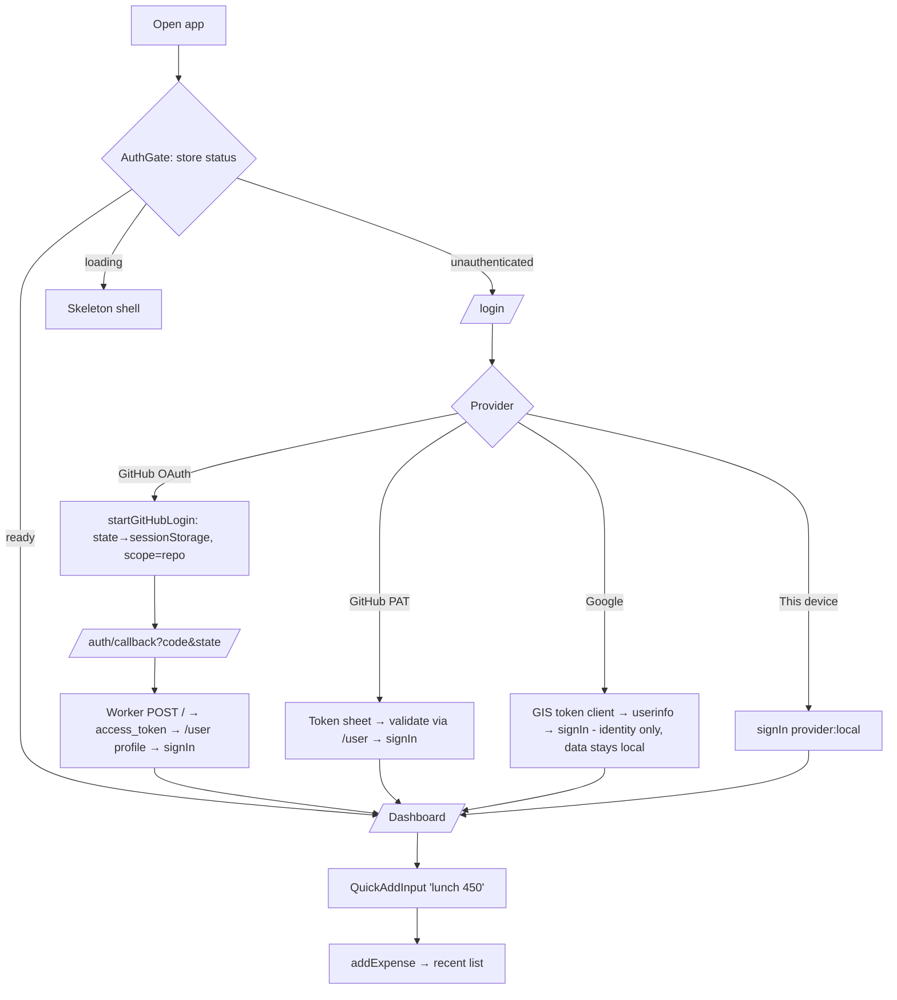
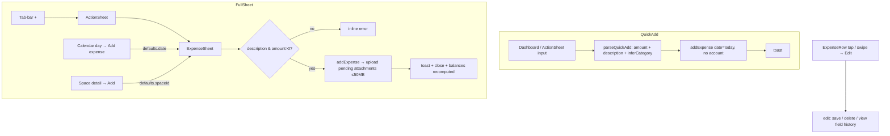
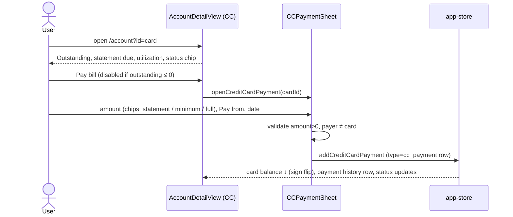
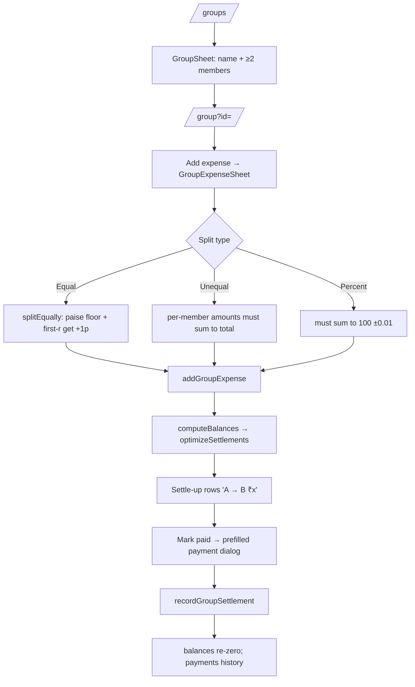
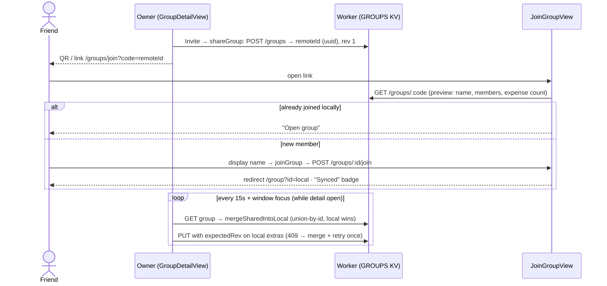
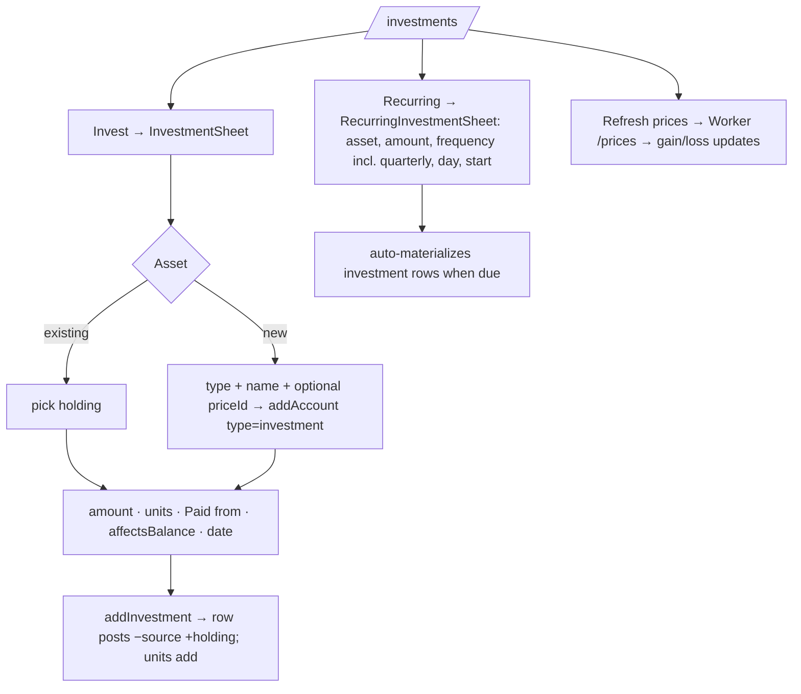
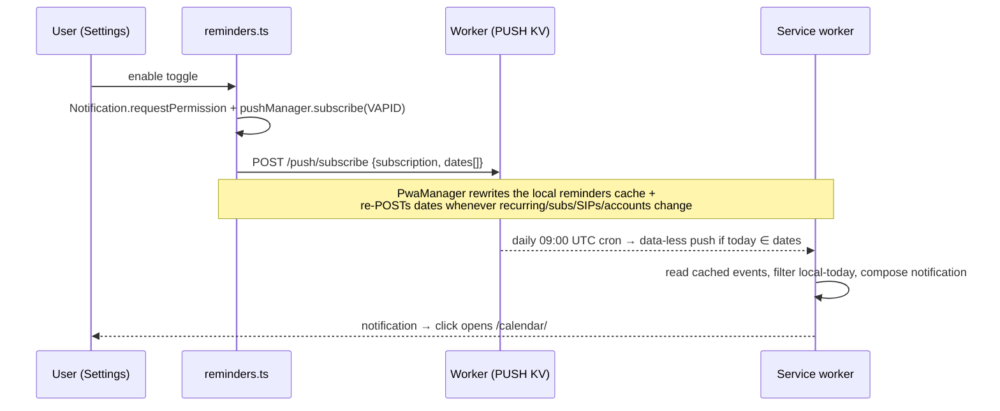

# 05 — User Flows

All flows verified against source. There is no separate onboarding — first launch lands on `/login`; there are no admin flows (single-user app).

## Authentication & first data



GitHub mode: on first load the adapter creates a **private `ledger-data` repo** (`auto_init`) if missing, then reads `data/*.json` (11 files in parallel).

## Adding an expense



Editing/deleting: `updateExpense` appends `{at, field, from, to}` history entries; `deleteExpense` also removes attachments and garbage-collects an investment account left with no transactions.

## Adding an account

```mermaid
flowchart TD
  A[/accounts/ or Settings] --> B[New → AccountSheet]
  B --> C[name · type · opening balance · as-of date]
  C --> D{type}
  D -- bank --> E[holder, account no, IFSC, branch, variant, min balance]
  D -- credit_card --> F[limit, statement balance, min due, due date]
  D -- investment --> G[assetType + priceId if needed]
  E & F & G --> H[addAccount → card appears]
  H --> I[/account?id= — Adjust · Reconcile · Edit/]
```

## Credit-card payment



## Group: create → split → settle



## Sharing a group / joining via link or QR



Caveat: the union merge has no tombstones — deletions resurrect, and edits to an existing item never propagate (see [09-state-management.md](09-state-management.md)).

## Investment + SIP



## Lend / borrow

```mermaid
flowchart TD
  A[Avatar menu → /lend-borrow/] --> B[+ → /lend-borrow/new/]
  B --> C[lent|borrowed · amount · person · description · date · due? · account tracking-only · attachments]
  C --> D[addLendBorrow → list with status chip]
  D --> E[/lend-borrow/detail?id=/]
  E --> F[Record Repayment ≤ outstanding · Settle Full shortcut]
  F --> G{outstanding ≤ 0?}
  G -- yes --> H[Fully Settled banner]
  E --> I[History → /lend-borrow/person/detail?name= net position]
  E --> J[Delete via native confirm]
```

## Backup / restore

```mermaid
flowchart TD
  A[/settings/ → Data] --> B[Export backup → JSON download - no tokens, no attachment blobs]
  A --> C[Import backup → file picker]
  C --> D{window.confirm full replace?}
  D -- no --> A
  D -- yes --> E[parseBackup: per-file migrate + Zod validate]
  E -- ok --> F[replace ALL 11 collections → recompute → persist 11 files]
  E -- BackupParseError --> G[specific error toast]
```

## Reminders (push)



## Sign-out

`signOut` clears the session key and store state but does **not** revoke the GitHub token, purge `ledger:data:*` localStorage, or clear IndexedDB attachments — on a shared machine, local-mode data survives into the next session.
