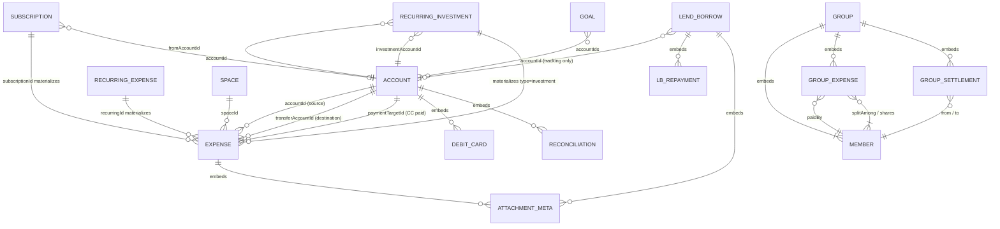

# 06 — Database (Data Model & Storage)

There is no relational database. The "database" is **11 named JSON documents** validated by Zod (`lib/domain/types.ts`), stored either in a private GitHub repo (`data/<file>.json`, one commit per write) or localStorage (`ledger:data:<file>`), plus attachment blobs (repo files or IndexedDB). All referential integrity is by-convention string IDs (`crypto.randomUUID()`), with **no foreign-key enforcement, no indexes, no uniqueness checks** — the app tolerates dangling references (e.g. deleted-account IDs on old expenses resolve to "no account" in the UI).

## Files (collections)

| File | Schema | Contents |
| --- | --- | --- |
| `expenses` | `Expense[]` | All transactions of all 5 types |
| `accounts` | `Account[]` | All accounts incl. credit cards, investment holdings |
| `recurring` | `RecurringExpense[]` | Recurring templates |
| `recurringInvestments` | `RecurringInvestment[]` | SIP schedules |
| `subscriptions` | `Subscription[]` | Subscriptions |
| `groups` | `Group[]` | Split groups (embedded members/expenses/settlements) |
| `lendBorrows` | `LendBorrow[]` | IOUs (embedded repayments) |
| `goals` | `Goal[]` | Savings goals |
| `spaces` | `Space[]` | Budget buckets |
| `budgets` | singleton `{monthlyBudget, categoryBudgets{}}` | |
| `settings` | singleton `{currency, tags[], showInvestmentsInExpenses}` | |

## ER diagram

## Entities (key fields; full definitions in `lib/domain/types.ts`)

**Account** (`types.ts:172-203`): `id, name, type, balance` (derived cache), `openingBalance` (default 0), `openingDate?` (hard-reset cutoff), `currency?` (decorative), `icon, archived, createdAt`. CC: `creditLimit?, statementBalance?, statementDueDate?, minimumDue?`. Bank: `minimumBalance?, holderName?, accountNumber?, ifscCode?, branchName?, bankAccountType?, debitCards[]`. Investment: `assetType?, unitLabel?, currentPrice?, priceId?, priceUpdatedAt?`. Reconciliation: `reconciledBalance?, reconciledDate?, reconciliations[]`.

**Expense** (`types.ts:230-266`) — the universal transaction row: `id, description, amount` (positive decimal rupees), `category, date` (`YYYY-MM-DD` local), `type` (expense|income|transfer|cc_payment|investment, default expense), `accountId?` (source), `transferAccountId?` (destination for transfer/investment), `paymentTargetId?` (destination CC), `debitCardId?` (never set by UI), `spaceId?, recurringId?, subscriptionId?`, `units?` (investment), `incomeCategory?, source?` (income), `affectsBalance` (default true), `tags[], notes?, attachments[]` (metadata only), `updatedAt?, history?[]` (`{at, field, from, to}` audit entries).

**RecurringExpense** (`types.ts:268-290`): `kind` (expense|income|transfer|cc_payment), `frequency` (daily|weekly|monthly|yearly), `dayOfMonth` (persistent anchor), `weekday?/monthOfYear?` (**declared, never read**), `startDate, lastMaterializedDate?, active`.

**RecurringInvestment** (`types.ts:392-410`): adds `quarterly`; `fromAccountId` + `investmentAccountId` required; `affectsBalance` per-schedule.

**Subscription** (`types.ts:216-228`): `billingCycle` (weekly|monthly|quarterly|yearly), `nextRenewalDate` (mutable pointer — anchor drifts after short months), `active`.

**Group** (`types.ts:328-339`): embedded `members[] {id,name}`, `expenses[]`, `settlements[]`; sync state `remoteId?, rev?, selfMemberId?`. **GroupExpense**: `paidBy, splitType` (equal|unequal|percentage), `splitAmong[]` (min 1), `shares[] {memberId, value}`. **GroupSettlement**: `from, to, amount, date, note?`.

**LendBorrow** (`types.ts:373-388`): `type` (lent|borrowed), `personName` (join key for person pages — case-insensitive match, no person entity), `repayments[]`, `dueDate?` (drives Overdue status), `attachments[]`.

**Goal** (`types.ts:412-423`): `type` (gold|silver|emergency|house|retirement|education|travel|custom), `targetAmount`, `accountIds[]`, `targetDate?`.

**Space** (`types.ts:205-214`): `budget` (lifetime, not monthly), `icon` emoji, `archived`.

## Enums (complete)

- Expense categories (9): Food, Travel, Shopping, Bills, Health, Education, Entertainment, Investments, Other — **fixed; no custom categories**.
- Income categories (9): Salary, Freelance, Business, Interest, Dividends, Refunds, Gifts, Investments, Other.
- Account types (7): cash, bank, credit_card, debit_card, wallet, investment, other.
- Asset types (8): gold, silver, mutual_fund, etf, stock, sip, crypto, other (unit labels: g / units / shares / coins).
- Bank account variants: Savings, Current, Salary, Joint, NRE, NRO, Business. Debit networks: Visa, Mastercard, RuPay.
- Frequencies: recurring = daily/weekly/monthly/yearly; investments add quarterly; billing cycles = weekly/monthly/quarterly/yearly.
- Time presets: today, yesterday, last7, thisWeek, lastWeek, thisMonth, lastMonth, thisYear, all, custom.

## Validation, defaults & lifecycle

- Every load runs raw → `JSON.parse` → `migrate()` → `safeParse`. **On Zod failure the file silently falls back to empty/default** (`lib/storage/repository.ts:77-87`) — a data-safety hazard because the next write persists the empty state (see [14-technical-debt.md](14-technical-debt.md)). Backup import, by contrast, **throws** per-section (`BackupParseError`).
- Dates are `YYYY-MM-DD` device-local strings; comparisons are lexicographic (valid for zero-padded ISO). Timestamps are `Date.toISOString()` strings.
- Soft deletes: accounts/spaces `archived`; recurring/subscriptions/SIPs `active:false`. Hard deletes elsewhere. No cascade rules; deleting an account leaves its transactions in place (dangling `accountId`).
- Seeds: `DEFAULT_ACCOUNTS` = Cash 💵 + Bank 🏦; `DEFAULT_SETTINGS` currency "₹".

## Migrations (`lib/storage/migrations.ts`)

**No schema version number exists** — migrations are idempotent shape-normalizers run on *every* load:

| Target | Transformation |
| --- | --- |
| expenses | default `tags/attachments/affectsBalance`; drop legacy `paymentMethodId` |
| accounts | synthesize `openingBalance` from legacy `balance`; default `openingDate = today` |
| recurring | default frequency monthly; convert legacy `startMonth`/`lastMaterializedMonth` + `dayOfMonth` → `startDate`/`lastMaterializedDate` |
| groups | default `splitType:"equal"`, `shares:[]`, `settlements:[]` |
| budgets | default `categoryBudgets:{}` |
| settings | default `tags:[]`; delete legacy `paymentMethods` |
| others | pass-through |

## Attachments

- Metadata (`{id, name, mimeType, size, createdAt}`) embedded in the parent entity; bytes stored separately.
- GitHub store: `attachments/<id>.<ext>` (raw base64 commit); legacy `attachments/<id>.json` fallback still readable; >1 MB reads fall back to the git blob API. IndexedDB store: `ledger:attachment:<id>`.
- **No enforced size limit at the storage layer** (UI caps at 50 MB); no orphan cleanup beyond delete-parent paths; backups exclude blobs, so restore on a new device yields dangling attachment metadata; switching auth modes strands attachments in the other store.
