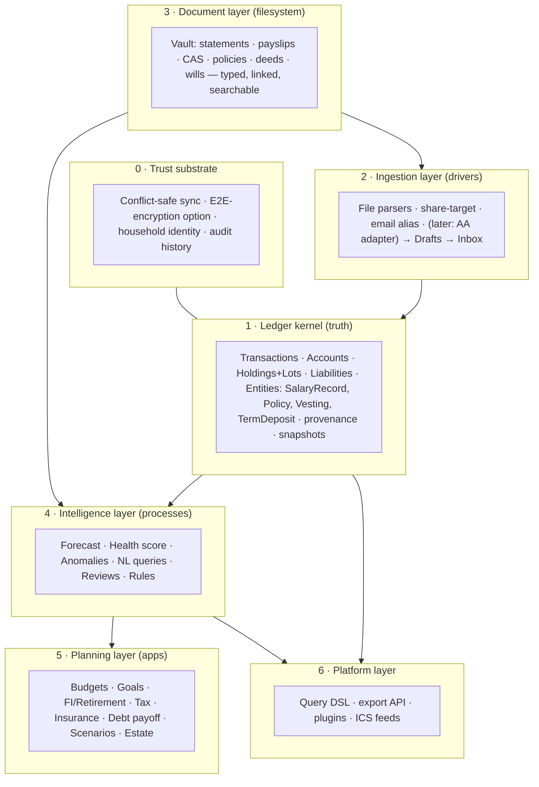

# 05 — The Personal Finance OS: Capability Blueprint

The "OS" framing, taken seriously: an operating system has a **kernel** (truth), **drivers** (ingestion), **processes** (intelligence), **a filesystem** (documents), **users/permissions** (household), and **an app layer** (planning surfaces + API). This document is the target architecture each roadmap year builds toward; time-phasing lives in [09-long-term-roadmap.md](09-long-term-roadmap.md).

## Layer 0 — Trust substrate (the unglamorous foundation)

Today: GitHub LWW + capability-URL groups — sufficient for one device, one user. The OS needs: **(a)** conflict-safe multi-device sync — evolutionary path: op-log/outbox + 3-way merge on the GitHub backend first; then an optional dedicated sync target (CRDT-ish op log on Worker KV/Durable Objects or user-owned object storage), keeping GitHub as the always-available export/audit copy; **(b)** **E2E encryption as an option** — the moment data leaves GitHub's private-repo model (shared groups already do; household will), client-held keys become the differentiator no US competitor offers; **(c)** identity for households (below). *Everything above this layer amplifies data-loss bugs — this ships first.*

## Layer 1 — Ledger kernel extensions

The 5-type Expense row + derived balances survive the decade — they are the right kernel. Additions, not rewrites: **lots** for holdings (sell legs, realized gains, corporate actions), **liability accounts** (loans/EMI amortization; statement-cycle records for cards), **term deposits** (FD/RD/SGB with maturity schedules), **structured entities** (SalaryRecord, VestingSchedule, Policy, Document) as new DataFiles per the existing Zod pattern, **provenance** on every row, **monthly snapshots** (net worth, per-account balances, holdings) — the time-series the entire intelligence layer feeds on, and history that survives even aggressive future data-model changes.

## Layer 2 — Ingestion (fully specified in [03-automation-strategy.md](03-automation-strategy.md))

The adapter seam is the strategic asset: statements → CAS → payslips → share-target → email alias → *someday* Account Aggregator, all normalizing into the same Draft/Rules/Dedup/Inbox spine. The Inbox is the OS's "notification center + task manager" — the single place automation meets consent.

## Layer 3 — Document vault (the filesystem)

Generalize today's per-transaction attachments into a first-class store: every document typed (statement/payslip/policy/deed/will/certificate), dated, tagged to FY, linked bidirectionally (transaction ↔ source doc ↔ entity), searchable, with expiry metadata feeding the calendar. Storage: same adapter pattern (repo/IndexedDB; size limits argue for optional object-storage backend later, E2E-encrypted). The vault is what makes tax season, insurance claims, and estate handover *retrieval problems instead of archaeology*.

## Layer 4 — Intelligence ([04-ai-features.md](04-ai-features.md))

Rules engine · forecast · anomalies · health score · NL-query DSL · review narrations. All read-only over L1+L3; all outputs land as inbox items or dashboard cards; deterministic core, AI at the edges.

## Layer 5 — Planning apps (each replaces a product)

| App | Replaces | Core mechanic (all deterministic) |
| --- | --- | --- |
| Budget & cash-flow | YNAB-lite | existing budgets + forecast + income-relative savings rate |
| Goals & big purchases | goal planners | funding-rate math, per-goal account mapping (exists), feasibility checks |
| FI/Retirement | Empower/FIRE calcs | FI number (25–33× expenses from *actual* data), coast/lean/fat variants, SWR bands, Monte-Carlo later |
| Tax organizer | spreadsheets + CA folder | FY ledger: realized-gains (from lots), deduction tagging (80C/80D/HRA), TDS vs 26AS, advance-tax calendar, CA export pack |
| Insurance | policy folders | Policy registry + renewal calendar + adequacy math (health-score sub-component) |
| Debt payoff | payoff planners | avalanche/snowball simulation on liability accounts, prepayment what-ifs |
| Scenarios | nothing good exists | parameterized runs over forecast+portfolio ("job loss", "8% inflation", "retire at 45", "buy the house") with assumption sheets |
| Estate & continuity | Kubera's beneficiary feature | nominee registry per asset, document completeness checklist, sealed emergency-access instructions, inactivity-triggered handover (worker cron — infra exists) |

## Layer 6 — Platform

The query DSL doubles as the public API; typed export (superset of today's backup); ICS feeds; eventually a plugin contract (custom parsers, custom dashboard cards) — the Lunch-Money lesson: power users extend what they love, and community bank-statement parsers are the only realistic way to cover India's long tail of formats.

## Design invariants (hold for a decade)

1. User-owned data, exportable at full fidelity, forever.
2. Every number traces to rows; every row traces to a source.
3. Nothing writes to the ledger without consent (inbox) — automation proposes, the user disposes.
4. Deterministic core; AI labeled and optional.
5. Local-first: full function without any Ledger-operated server (worker features degrade gracefully — this is already true today; keep it true).
6. One kernel: no feature gets its own parallel data store (the audit found the discipline holds; guard it).
