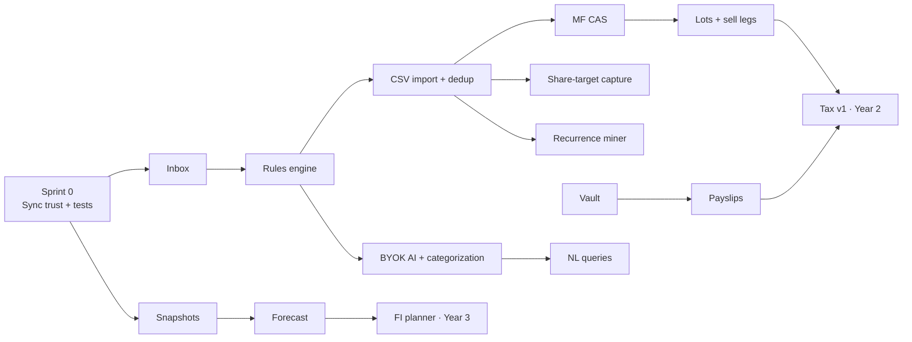

# 10 — Implementation Priority

The committee's single actionable answer to "what do I build next, in what order, and why". Item numbers from [07-feature-backlog.md](07-feature-backlog.md); debt numbers from `docs/14-technical-debt.md`.

## The prioritization rules (why this order)

1. **Trust before automation** — imports on a lossy sync layer automate data loss.
2. **The inbox before any producer** — every automation needs its consent surface first.
3. **Highest-frequency documents first** — bank CSV (monthly, every user) → MF CAS (monthly, this persona) → payslip (monthly) → demat CAS (monthly, fewer users) → email (amplifier, not source).
4. **Kernel entities before the apps that need them** — lots before tax; snapshots before FI; cycles before statement-reconcile.
5. **Quick wins ride along, never lead** — one per sprint, morale + visible momentum.
6. **Nothing lands without tests now** — the audit found zero tests; every new engine (dedup, parsers, lots, forecast) ships with its suite, and the four legacy cores (money/settlement/balances/migrations) get theirs in Sprint 0.

## Dependency spine

## The first 90 days (three 30-day blocks)

### Block 1 — Sprint 0: the floor (debt items 1, 2, 3, 8, 11, 13, 16 + tests)
Fix offline-boot sign-out, silent Zod-wipe, dropped writes (outbox + retry), worker `expectedRev` bug, `ensureRepo` brick, CORS default, sign-out hygiene. Stand up Vitest; test money/settlement/balances/migrations. Quick wins: honest Google copy, income-relative savings rate.
**Gate**: a week of two-device use with deliberate conflict attempts and zero loss.

### Block 2 — Inbox + Rules (+ snapshots)
Build the Review Inbox shell (drafts, alerts, digest badge — `app/inbox/` finally earns its directory) and the rules engine with the "make this a rule?" correction loop. Ship monthly net-worth/holdings snapshots (small, unblocks the dashboard chart quick-win and all future intelligence).
**Gate**: rules demonstrably firing on new manual entries; snapshot file accumulating.

### Block 3 — CSV statement import v1
One bank profile (the author's own bank first — dogfood), column-mapping wizard, narration decoder v1 (UPI/NEFT/NACH/ATM/interest grammars over the existing brand registry), full dedup engine with conservative thresholds, provenance + idempotent re-import, closing-balance reconciliation summary.
**Gate**: import 3 months of real statements twice — second import is a no-op; dedup precision ≥95% against manually entered history; every merge reversible.

## Months 4–12 (Year-1 completion, in order)

4. **MF CAS parser** + opening-lot migration for existing holdings (items 5, 6).
5. **CC statement cycles + loan/EMI accounts** (8, 9) — closes the liability story; feeds forecast.
6. **Share-target + paste capture** (10) — text first, screenshots after.
7. **Recurrence miner + change alerts** (14) — the "it noticed before I did" moment.
8. **Cash-flow forecast v1** (13) on the now-rich upcoming feed.
9. Quick-win basket completion (22): search deep-links, tag search, reminder lead-times, ICS feed, debit-card picker, week pager.

## Deliberately deferred (and why)

| Deferred | Until | Because |
| --- | --- | --- |
| Email alias, payslips, vault, tax, AI, NL queries | Year 2 | Each depends on the ingestion spine being trustworthy and tested in the field |
| Custom categories, multi-currency | Year 2–3 | Wide migration blast radius; not on the critical path to "captures itself" |
| Household, E2E sync service, estate | Year 5 gate | Requires the entity decision + boring-solid sync; premature attempts are the roadmap's biggest failure mode |
| Account Aggregator | Year 10 (or never) | Legal entity + compliance; the adapter seam keeps it cheap to add later |
| PDF statement parsing | after CSV proves the spine | Hardest format, same value as CSV for most banks; don't fight PDFs before the pipeline works |

## Resourcing reality check

Solo/nights-and-weekends: Sprint 0 + Blocks 2–3 are ~a quarter; Year 1 as scoped is realistically 12–18 months — cut demat CAS and screenshots before cutting tests or dedup quality. One full-time engineer: Year 1 fits a year with room for the quick-win basket. The single highest-leverage hire/collaboration if any: someone who owns **parser packs** (bank/CAS/payslip formats) as data-driven artifacts with fixtures — it's the only workstream that scales horizontally without touching the kernel.

## What "done with Year 1" feels like

The user's Sunday: open Ledger → inbox shows "Statement matched: 47 auto-merged, 3 to review · 2 new subscriptions found · projected dip on the 4th" → four taps → close. The ledger is true, the portfolio is current, and nobody typed anything. That is the foundation every later year — tax, planning, household, estate — quietly assumes.
